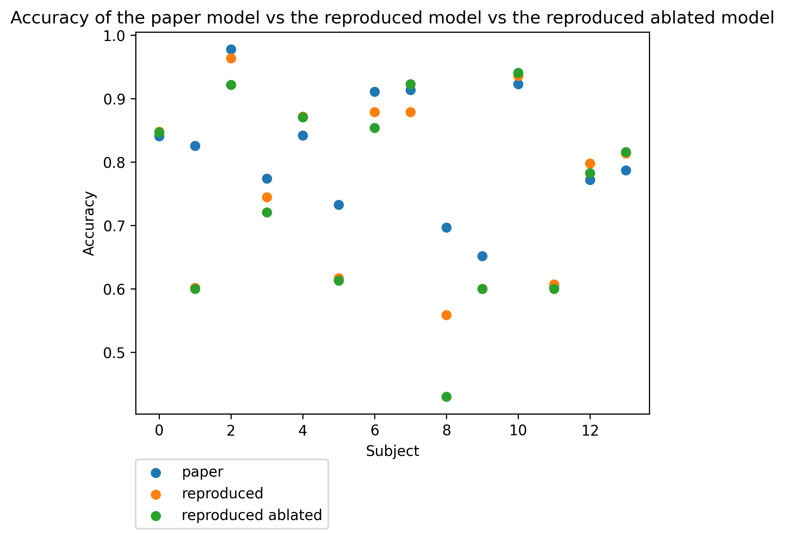

# Adversarial representation learning for robust patient-independent epileptic seizure detection – Reproduction

**PDF: [J-BHI](https://ieeexplore.ieee.org/abstract/document/8994148)
, [arXiv](https://arxiv.org/abs/1909.10868)**

**Paper Authors: [Xiang Zhang](http://xiangzhang.info/)
([xiang_zhang@hms.harvard.edu](mailto:xiang_zhang@hms.harvard.edu)),
[Lina Yao](https://www.linayao.com/)
([lina.yao@unsw.edu.au](mailto:lina.yao@unsw.edu.au)), Manqing Dong, Zhe Liu, Yu Zhang, Yong Li**

**Repository Contributors: Alex Pissinou Makki ([alexpissinoumakki@gmail.com](mailto:alexpissinoumakki@gmail.com))**

# Table of Contents

1. [Overview](#overview)
2. [Dependencies](#dependencies)
3. [Dataset](#dataset)
4. [Training Code](#training-code)
5. [Evaluation Code](#evaluation-code)
6. [Pre-trained Model](#pre-trained-model)
7. [Results](#results)
8. [Citing](#citing)
9. [Miscellaneous](#miscellaneous)
10. [License](#license)

## Overview

This repository contains reproducible codes for the proposed adversarial_seizure_detection model.  
In this paper, the authors propose a novel and generic deep learning framework aiming at patient-independent epileptic
seizure diagnosis. The proposed approach refines the seizure-specific representation by eliminating the inter-subject
noise through adversarial training. Moreover, the authors involve the attention mechanism to learn the contribution of
each EEG channel in the epileptic seizure detection, which empowers the method with great explainability. For more
details on the algorithm, please refer to the paper.

## Dependencies

<!--
f you are using Python, this means providing a requirements.txt file (if using
pip and virtualenv), providing environment.yml file (if using anaconda), or a
setup.py if your code is a library.

It is good practice to provide a section in your README.md that explains how to
install these dependencies. Assume minimal background knowledge and be clear
and comprehensive - if users cannot set up your dependencies they are likely
to give up on the rest of your code as well.

If you wish to provide whole reproducible environments, you might want to
consider using Docker and upload a Docker image of your environment into
Dockerhub.
-->

Dependencies required to run this project are provided in `requirements.txt`. Please follow the steps below to set up
your environment for this project:

#### 1. [_Recommended_, Optional] Create a virtual environment

This project uses Python3.6+, so I recommend that you have at least Python3.6 installed on your machine. YOu can refer
to this
[guide](https://docs.python-guide.org/starting/installation/) to help you in installation of Python. Once you have
Python3.6+ installed, in this project's directory, you can use the following command:

```shell
python3 -m venv venv
```

to create a Python3.6+ virtual environment. I will use this environment for this project to make sure all changes /
package installations are localized and can be easily reversed. Make sure to have activated this virtual environment
before proceeding to the next steps by running:

```shell
source venv/bin/activate
```

#### 2. Install the dependencies

You can use the provided `requirements.txt` file to install all the required dependencies using the command:

```shell
python3 -m pip install -r requirements.txt
```

***Note:*** For the rest of the instructions, please ensure that you have activated the virtual environment created
in step 1.

## Dataset

The cleaned dataset `all_14sub.p` (894 Mb) is too large to be included here. You can either:

1. Download the original dataset (*The TUH EEG Seizure Corpus (TUSZ)*) at the TUH Corpus website
   [here](https://www.isip.piconepress.com/projects/tuh_eeg/html/downloads.shtml), and perform the "cleaning"
operations mentioned in the paper or
2. Contact [alexpissinoumakki@gmail.com](mailto:alexpissinoumakki@gmail.com) to provide you with the cleaned dataset
   used in this repository provided by the authors of this paper.
Once you have the cleaned dataset, make sure it is named `all_14sub.p` and placed in the `data/` directory.

## Training code

<!--
Your code should have a training script that can be used to obtain the
principal results stated in the paper. This means you should include
hyperparameters and any tricks that were used in the process of getting your
results. To maximize usefulness, ideally this code should be written with
extensibility in mind: what if your user wants to use the same training script
on their own dataset?

You can provide a documented command line wrapper such as train.py to serve as
a useful entry point for your users.
-->

To run the training code using the _original_ model, you can use the following command:
```shell
python3 main.py --mode train --data_dir data/ --models_dir models/ --model_type "original"
```
To run the evaluation code using the _ablated_ model, you can use the following command:
```shell
python3 main.py --mode train --data_dir data/ --models_dir models/ --model_type "ablated"
```
Before using the ablated model, ensure that you have commented out the lines in `model.py` as instructed
by the comments in that file.


___Note:___ Executing the above commands will overwrite the existing models in the `models/` directory.


## Evaluation code

<!--
Model evaluation and experiments often depend on subtle details that are not
always possible to explain in the paper. This is why including the exact code
you used to evaluate or run experiments is helpful to give a complete
description of the procedure. In turn, this helps the user to trust, understand
and build on your research.

You can provide a documented command line wrapper such as eval.py to serve as
a useful entry point for your users.
-->

To run the evaluation code using the _original_ model, you can use the following command:
```shell
python3 main.py --mode eval --data_dir data/ --models_dir models/ --model_type "original"
```
To run the evaluation code using the _ablated_ model, you can use the following command:
```shell
python3 main.py --mode eval --data_dir data/ --models_dir models/ --model_type "ablated"
```

Please ensure that the models directory and the data directory are accessible and contain
the pre-trained models and the cleaned dataset, respectively.

## Pre-trained model

<!--
Training a model from scratch can be time-consuming and expensive. One way to
increase trust in your results is to provide a pre-trained model that the
community can evaluate to obtain the end results. This means users can see the
results are credible without having to train afresh.

Another common use case is fine-tuning for downstream task, where it's useful
to release a pretrained model so others can build on it for application to
their own datasets.

Lastly, some users might want to try out your model to see if it works on some
example data. Providing pre-trained models allows your users to play around
with your work and aids understanding of the paper's achievements.
-->
The pre-trained models are available in the `models/` directory. The hierarchy is:
```markdown
models/
    |- main/
    |   |- subject_{id}_{metric}_main_model/
    |   |- ...
    |- ablated/
    |   |- subject_{id}_{metric}_ablated_model/
    |   |- ...
    |- v1/ -- old version of the models
```

The models saved in the `subject_{id}_{metric}_{model_name}_model/` directories are saved
in the SavedModel format ([link](https://www.tensorflow.org/tutorials/keras/save_and_load#savedmodel_format)). As such,
you do not need access to the source code to use them. You can simply use the following command:
```python
new_model = tf.keras.models.load_model('main/subject_{id}_{metric}_main_model/')
```
You can replace the input to `load_model` with any of the subdirectories of the `main/` or `ablated/` directory.

The model saved in `subject_{id}_{metric}_{model_name}_model` refers to the best trained `{model_name}` (either `main`
or `ablated`) model with subject `{id}` used as the hold out test set and metric `{metric}` used as the metric to
evaluate the model.

In the next section, you can use the pre-trained models to evaluate generate results.

## Results

<!--
5. README file includes table of results accompanied by precise command to run
to produce those results
Adding a table of results into README.md lets your users quickly understand
what to expect from the repository (see the README.md template for an example).
Instructions on how to reproduce those results (with links to any relevant
scripts, pretrained models etc.) can provide another entry point for the user
and directly facilitate reproducibility. In some cases, the main result of a
paper is a Figure, but that might be more difficult for users to understand
without reading the paper.

You can further help the user understand and contextualize your results by
linking back to the full leaderboard that has up-to-date results from other
papers. There are multiple leaderboard services where this information is
stored.
-->
Results of the reproduction study are available in the following tables. You can run the following command to get the results:
```shell
python3 analysis.py
```

_Note_: The results are retrieved from the logs available in the `logs/` directory. Moreoever,
the saved models in the `models/` directory are also used to generate sensitivity and specificity
on the test set for each subject. `.csv` and `.json` files are also saved in the `figures/` directory and can be used
for further analysis.

<table>
<tr>
<td>
<b>Accuracy</b> metrics table:

| paper | repro | repro ablated |
| ----- | ----- | ------------- |
| 0.841 | 0.848 | 0.847         |
| 0.826 | 0.602 | 0.6           |
| 0.978 | 0.964 | 0.922         |
| 0.774 | 0.745 | 0.721         |
| 0.842 | 0.872 | 0.871         |
| 0.733 | 0.617 | 0.613         |
| 0.911 | 0.879 | 0.854         |
| 0.914 | 0.879 | 0.923         |
| 0.697 | 0.559 | 0.43          |
| 0.652 | 0.6   | 0.6           |
| 0.923 | 0.936 | 0.941         |
| 0.604 | 0.607 | 0.6           |
| 0.772 | 0.798 | 0.783         |
| 0.787 | 0.814 | 0.816         |
</td>
<td>


</td>
</tr>
<tr>
<td>
<b>Sensitivity</b> and <b>Specificity</b> metrics table for "repro":

| metric      | paper | repro |
|-------------|-------|-------|
| sensitivity | 0.974 | 0.857 |
| specificity | 0.881 | 1.000 |
</td>
<td>
<b>Sensitivity</b> and <b>Specificity</b> metrics table for "repro ablated":

| metric      | paper | repro | repro ablated |
|-------------|-------|-------|---------------|
| sensitivity | 0.974 | 0.765 | 0.735         |
| specificity | 0.881 | 1.000 | 1.000         |
</td>
</tr>
</table>


Here, I have reported the maximum accuracy for each subject achieved with the reproduced and reproduced ablated models
in TF2. The original implementation is in TF1.x which can explain some of the differences in the reported metrics.
Moreover, since the authors reported the sensitivity and specificity of their best-performing model, I have reported
the best-performing model for the original reproduction and original reproduction + attention ablation.

## Citing

If you find this work useful for your research, please consider citing the original paper:

```
@article{zhang2020adversarial,
  title={Adversarial representation learning for robust patient-independent epileptic seizure detection},
  author={Zhang, Xiang and Yao, Lina and Dong, Manqing and Liu, Zhe and Zhang, Yu and Li, Yong},
  journal={IEEE journal of biomedical and health informatics},
  volume={24},
  number={10},
  pages={2852--2859},
  year={2020},
  publisher={IEEE}
}
```

## Miscellaneous

Please send any questions you might have about the code and/or the algorithm
to [alexpissinoumakki@gmail.com](mailto:alexpissinoumakki@gmail.com).

## License

This repository is licensed under the MIT License.
